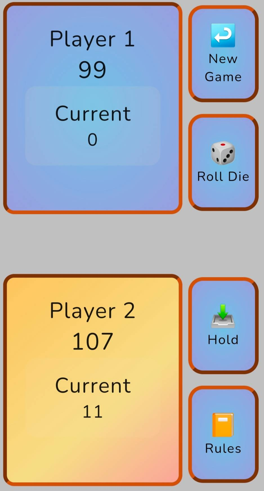
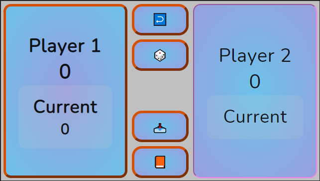

# Pig Game

2 player, button-based game

## Table of Contents

-   [Introduction](#introduction)
-   [Technologies](#technologies)
-   [Launch](#launch)
-   [Illustration](#Illustration)
-   [Sources](#sources)
-   [Contact Me](#contact)

## Introduction

The goal of the project was primarily to practice javascript functionality.
Additionally, I wanted to practice CSS Grid layout and utilizing CSS Variables.
From creating my layout and selecting the colors, to adding in a modal window to explain how the game is played, I had a lot of fun building this project!

Although I completed this project and made it my own, a while ago, I continue to work on it as I think of different ideas and get feedback from new users. Recently I made changes to enhance the visual cue of the change in players' turns. Additionally, I added a delay in button functionality for the "hold" & "roll" buttons to inhibit a player from accidentally using the next player's turn.

## Technologies

-   JavaScript6
-   CSS3 - Grid, Flexbox, Variables
-   HTML5

## Launch

[Site for the game](https://anthonychavis.github.io/pig_game/)

## Illustration

## Sources

This project was based on [The Complete JavaScript Course 2022: From Zero to Expert!, by Jonas Schmedtmann](https://www.udemy.com/course/the-complete-javascript-course/) -
[Original Project Source Code](https://github.com/jonasschmedtmann/complete-javascript-course/tree/master/07-Pig-Game/final).

The README layout was inspired by [Rita Łyczywek](https://bulldogjob.com/news/449-how-to-write-a-good-readme-for-your-github-project)

## Contact

Created by [Anthony Chavis](gitanthony@yahoo.com).
